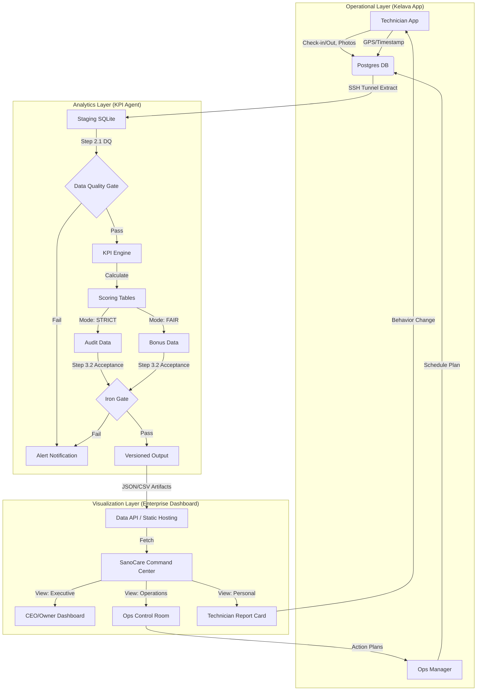

# SanoCare Data Platform: End-to-End Architecture

## Data Flow Description

1.  **Ingest**: Transactional data (Postgres) is extracted daily via secure tunnel.
2.  **Process**: The `KPI Agent` cleans, scores, and audits data using `kpi_config.yaml` rules.
3.  **Validate**: Iron Gate (Step 3.2) ensures no "bad math" reaches the dashboard.
4.  **Publish**: Validated data is published as static artifacts (CSVs, JSONs) in `runs/LATEST/`.
5.  **Visualize**: The **Enterprise Dashboard** reads these artifacts to render professional UIs.
