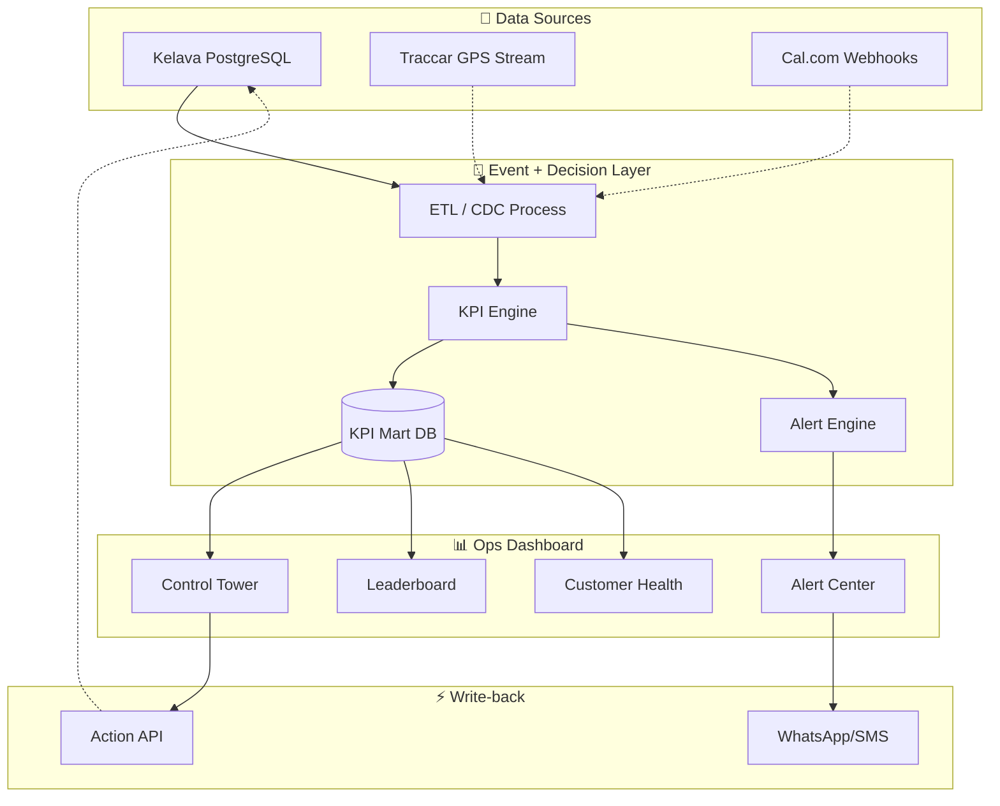

# 🏗️ Architecture Masterplan: Safe & Care Operational Intelligence

> **Filosofi Utama:** *"Kelava = Otot, Kamu Bangun Otaknya"*
>
> Kelava sudah kuat sebagai sistem eksekusi lapangan. Yang dibutuhkan sekarang adalah **lapisan kecerdasan** yang mengubah data mentah menjadi keputusan operasional.

---

## 📐 Arsitektur 4 Lapisan

```
┌─────────────────────────────────────────────────────────────────────────────┐
│                        ARCHITECTURE OVERVIEW                                 │
├─────────────────────────────────────────────────────────────────────────────┤
│                                                                              │
│   [1. Field Ops App]  →  [2. Event+Decision]  →  [3. Ops UI]  →  [4. Write] │
│        (Kelava)              Layer                Dashboard       back       │
│                           (yang dibangun)      (yang dibangun)   (opsional) │
│                                                                              │
└─────────────────────────────────────────────────────────────────────────────┘
```

---

## 🔵 Layer 1: Field Ops Application (FSM)

### Komponen Saat Ini: **Kelava**

Kelava adalah *source-of-truth* untuk operasi lapangan:

| Data Point | Deskripsi |
|------------|-----------|
| `work_order` | Job/tugas yang dijadwalkan |
| `visit` | Kunjungan aktual ke lokasi |
| `evidence` | Bukti foto, tanda tangan, timestamp |
| `worker` | Data teknisi/petugas lapangan |
| `customer` | Data pelanggan dan lokasi |
| `territory` | Area/zona operasional |
| `schedule` | Penjadwalan recurring |

### Alternatif Masa Depan

| Opsi | Kapan Dipakai | Trade-off |
|------|---------------|-----------|
| **Odoo + OCA Field Service** | Butuh CRM + invoicing + kontrak terintegrasi | Migrasi berat, adopsi tim lapangan lama |
| **ERPNext / Frappe Custom** | Ingin "own the stack", sudah ada ecosystem ERPNext | Harus bangun UX lapangan dari nol |

### Keputusan Strategis

✅ **Tetap Kelava** untuk Tahap 1-2 (hindari perang adopsi lapangan)
📋 Evaluasi migrasi di Tahap 3 setelah dashboard & decision layer proven

---

## 🟢 Layer 2: Event + Decision Layer

### Fungsi Utama

Layer ini adalah **"otak"** yang:
1. **Mengumpulkan** data dari berbagai sumber (Kelava, Traccar, dll)
2. **Memproses** menjadi KPI dan metrik operasional
3. **Mendeteksi** anomali dan trigger alert
4. **Menghasilkan** insight yang actionable

### Komponen Teknis

```
┌─────────────────────────────────────────────────────────────────┐
│                    EVENT + DECISION LAYER                        │
├─────────────────────────────────────────────────────────────────┤
│                                                                  │
│  ┌──────────────┐    ┌──────────────┐    ┌──────────────┐       │
│  │  Data Sink   │───▶│  KPI Engine  │───▶│Alert/Trigger │       │
│  │  (ETL/CDC)   │    │  (Analytics) │    │   Engine     │       │
│  └──────────────┘    └──────────────┘    └──────────────┘       │
│         │                   │                   │                │
│         ▼                   ▼                   ▼                │
│  ┌──────────────────────────────────────────────────────┐       │
│  │              KPI Mart (PostgreSQL)                    │       │
│  │  - fact_daily_visit                                   │       │
│  │  - fact_technician_performance                        │       │
│  │  - fact_customer_health                               │       │
│  │  - fact_dispatch_efficiency                           │       │
│  └──────────────────────────────────────────────────────┘       │
│                                                                  │
└─────────────────────────────────────────────────────────────────┘
```

### Data Sources

| Source | Data | Refresh Rate |
|--------|------|--------------|
| Kelava PostgreSQL | Work orders, visits, evidence | Near real-time (CDC) atau batch hourly |
| Traccar (future) | GPS coordinates, geofence events | Real-time streaming |
| Cal.com (future) | Booking requests, availability | Event-driven |

### KPI Metrics yang Dihitung

**Dispatch & Route:**
- Dispatch-to-arrival time
- Route efficiency (actual vs optimal)
- Territory coverage %
- Idle time per technician

**Service Quality:**
- First-time fix rate
- SLA compliance %
- Evidence completeness score
- Customer satisfaction proxy

**Resource Utilization:**
- Technician utilization rate
- Jobs per day per technician
- Travel time ratio
- Overtime frequency

---

## 🟡 Layer 3: Ops UI / Dashboard

### Fungsi Utama

Dashboard untuk **decision-making** operasional, bukan sekadar reporting:

```
┌─────────────────────────────────────────────────────────────────┐
│                      OPS DASHBOARD                               │
├─────────────────────────────────────────────────────────────────┤
│                                                                  │
│  ┌─────────────────┐  ┌─────────────────┐  ┌─────────────────┐  │
│  │  CONTROL TOWER  │  │   LEADERBOARD   │  │  ALERT CENTER   │  │
│  │  (Live View)    │  │  (Performance)  │  │  (Anomalies)    │  │
│  └─────────────────┘  └─────────────────┘  └─────────────────┘  │
│                                                                  │
│  ┌─────────────────┐  ┌─────────────────┐  ┌─────────────────┐  │
│  │ DISPATCH BOARD  │  │ CUSTOMER HEALTH │  │  TREND CHARTS   │  │
│  │ (Assignment)    │  │ (Churn Risk)    │  │  (Historical)   │  │
│  └─────────────────┘  └─────────────────┘  └─────────────────┘  │
│                                                                  │
└─────────────────────────────────────────────────────────────────┘
```

### Key Views

| View | Target User | Decision Enabled |
|------|-------------|------------------|
| **Control Tower** | Dispatcher | Real-time assignment & re-routing |
| **Technician Leaderboard** | Manager | Performance coaching, incentive allocation |
| **Customer Health** | Account Manager | Churn prevention, upsell targeting |
| **Alert Center** | Operations Lead | Exception handling, escalation |
| **Trend Analysis** | Management | Strategic planning, capacity forecasting |

### Tech Stack Dashboard

- **Backend:** Python Flask/FastAPI
- **Frontend:** HTML + Vanilla CSS + JavaScript (atau React jika kompleks)
- **Charts:** Chart.js / ECharts / Plotly
- **Maps:** Leaflet.js / Mapbox
- **Real-time:** WebSocket untuk live updates

---

## 🔴 Layer 4: Write-back (Opsional)

### Fungsi

Kemampuan untuk **mengirim keputusan balik** ke sistem operasional:

```
Dashboard Decision  →  API Call  →  Kelava/Odoo/ERPNext
     (User)             (Auto)         (Execution)
```

### Use Cases

| Action | Trigger | Target System |
|--------|---------|---------------|
| Re-assign job | Dispatcher click | Kelava API |
| Send reminder | SLA threshold | WhatsApp/SMS |
| Block customer | Payment overdue | Kelava + Billing |
| Auto-schedule | Recurring rule | Kelava Scheduler |

### Implementation Priority

⏳ **Low priority** untuk Tahap 1 — fokus dulu pada read-only intelligence
📋 Pertimbangkan di Tahap 2-3 setelah decision layer stabil

---

## 🔧 Komponen Pelengkap

### Traccar (GPS Tracking)

```
┌─────────────────────────────────────────────────────────────────┐
│                     TRACCAR INTEGRATION                          │
├─────────────────────────────────────────────────────────────────┤
│                                                                  │
│   Mobile App        Traccar Server         Decision Layer        │
│   (GPS sender)  →   (tracking hub)    →    (consumer)           │
│                                                                  │
│   Features:                                                      │
│   • Real-time location every N seconds                          │
│   • Geofence entry/exit alerts                                  │
│   • Route history playback                                      │
│   • Speed & idle detection                                      │
│                                                                  │
└─────────────────────────────────────────────────────────────────┘
```

**Kapan dibutuhkan:** Saat Kelava check-in/out tidak cukup untuk kebutuhan tracking real-time.

### Cal.com (Scheduling)

```
Customer/CS  →  Cal.com (booking UI)  →  Webhook  →  Kelava/ERPNext
```

**Kapan dibutuhkan:** Saat ingin self-service booking dengan availability management.

---

## 📊 Data Flow Diagram



---

## 🔐 Security Considerations

| Layer | Security Measure |
|-------|------------------|
| Database | VPN tunnel, IP whitelist, encrypted connections |
| API | JWT auth, rate limiting, audit logging |
| Dashboard | Role-based access, SSO integration |
| Write-back | Action approval workflow, audit trail |

---

## 📁 Repository Structure

```
/Live SnC - Kelava Server/
├── analytics/
│   ├── sql/              # KPI queries & materialized views
│   ├── reports/          # Generated reports & insights
│   └── dashboard/        # Dashboard frontend
├── docs/
│   ├── ARCHITECTURE_MASTERPLAN.md  # This file
│   └── ROADMAP.md                   # Implementation timeline
├── scripts/
│   ├── etl/              # Data extraction scripts
│   └── kpi/              # KPI calculation jobs
└── config/
    └── connections/      # Database & API configurations
```

---

## ✅ Success Metrics

Arsitektur ini berhasil jika:

1. **Decision Latency < 5 menit** — Dari event terjadi sampai muncul di dashboard
2. **Adoption > 80%** — Dispatcher/manager menggunakan dashboard setiap hari
3. **Action Rate > 50%** — Insight berujung pada tindakan nyata
4. **Zero Downtime** — Tidak mengganggu operasional Kelava existing

---

*Dokumen ini adalah living document. Update sesuai perkembangan implementasi.*

**Last Updated:** 2026-02-05
**Version:** 1.0
