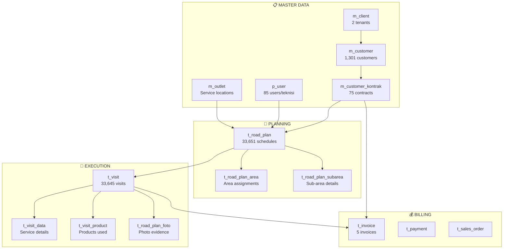
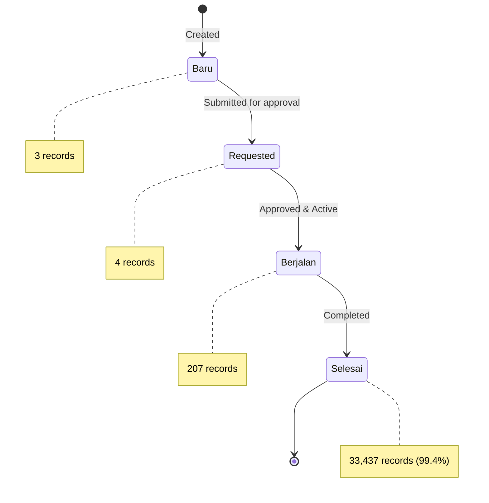
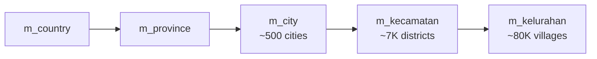
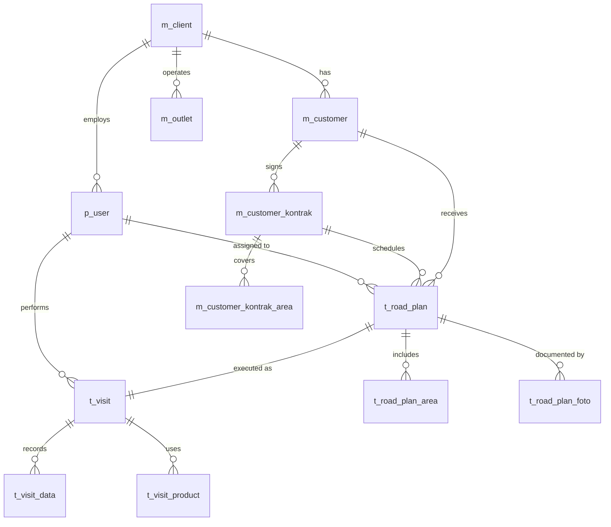

# SanoCare Database - Data Flow & Core Apps

> **Generated:** 2026-01-10 | **Database:** PostgreSQL @ app.kelava.id

---

## 📊 Database Overview

| Metric | Value |
|--------|-------|
| **Total Tables** | 154 |
| **Database Size** | ~200MB |
| **Primary Domain** | Pest Control Service Management |

### Entity Counts (Live Data)

| Entity | Count | Notes |
|--------|-------|-------|
| road_plans | 33,651 | Scheduled visits |
| visits | 33,645 | Executed visits (check-in/out) |
| customers | 1,301 | Registered clients |
| users (teknisi) | 85 | Field technicians + staff |
| kontrak | 75 | Active contracts |
| invoices | 5 | Billing records |
| clients (tenant) | 2 | SaaS tenants |

---

## 🏗️ Core Data Architecture

### Table Naming Convention
| Prefix | Meaning | Example |
|--------|---------|---------|
| `m_` | Master data | `m_customer`, `m_product` |
| `t_` | Transactional | `t_visit`, `t_invoice` |
| `p_` | Platform/User | `p_user`, `p_role` |
| `s_` | Settings/System | `s_pos` |
| `x_` | Extended config | `x_setting_application` |
| `target_` | KPI targets | `target_sales` |

---

## 🔄 Core Application Flow

---

## 🎯 Road Plan Flow (Core Business Process)

### Status Lifecycle

### Road Plan Types
| Type | Count | Description |
|------|-------|-------------|
| `t_mobile` | 20,630 | Mobile technician visit |
| `t_station` | 8,173 | Station-based service |
| `checklist` | 2,759 | Routine checklist |
| `spv_tc` | 1,862 | Supervisor technical check |
| `spv_qc` | 223 | Supervisor quality control |

---

## 🔑 Key Entities Detail

### m_customer (45 columns)
Customer master data with full profile.

| Key Columns | Type | Purpose |
|-------------|------|---------|
| `id`, `code`, `name` | identity | Unique identification |
| `address`, `id_city`, `id_kecamatan`, `id_kelurahan` | location | Geographic hierarchy |
| `phone1`, `phone2`, `email` | contact | Communication |
| `id_segment`, `id_customer_group` | classification | Business segmentation |
| `credit_limit`, `payment_term` | financial | Billing terms |
| `id_owner`, `is_owner` | ownership | Multi-outlet support |
| `id_sales` | relationship | Assigned salesperson |

### t_road_plan (16 columns)
Scheduled service visits.

| Key Columns | Type | Purpose |
|-------------|------|---------|
| `id`, `no_ra` | identity | Visit ID & reference number |
| `visit_date` | timestamp | Scheduled date |
| `status` | enum | Baru/Requested/Berjalan/Selesai |
| `type` | enum | t_mobile/t_station/checklist/spv_* |
| `id_user` | FK | Assigned technician |
| `id_customer`, `id_outlet` | FK | Customer & location |
| `id_kontrak` | FK | Contract reference |
| `is_cancel` | boolean | Cancellation flag |

### t_visit (19 columns)
Executed visits with GPS tracking.

| Key Columns | Type | Purpose |
|-------------|------|---------|
| `id`, `id_road_plan` | identity | Links to schedule |
| `check_in`, `check_out` | timestamp | Time tracking |
| `latitude`, `longitude` | numeric | Check-in GPS |
| `latitude_o`, `longitude_o` | numeric | Check-out GPS |
| `meta_data`, `additional_data` | JSON | Flexible service data |
| `meta_distance` | JSON | Distance calculations |
| `realization_date` | date | Actual service date |

### m_customer_kontrak (8 columns)
Service contracts.

| Key Columns | Type | Purpose |
|-------------|------|---------|
| `id`, `no_kontrak` | identity | Contract number |
| `id_customer` | FK | Customer reference |
| `start_date`, `end_date` | date | Contract period |
| `is_active` | enum | Active status |
| `kode_akses` | varchar | Access code |

---

## 📍 Geographic Hierarchy

---

## 🔗 Entity Relationship Summary

---

## 📱 Supporting Modules

### Notifications (`t_notif`)
- 13,346 notification records
- Push notifications to mobile app

### Membership (`m_membership_*`)
- Customer loyalty program
- Level-based benefits

### Ticketing (`t_ticket`, `m_ticket_*`)
- Customer complaint handling
- SLA tracking

### Events (`t_event`, `t_event_*`)
- Special event scheduling
- Event assignments & results

---

## 📈 Data Points Summary

| Category | Available Data Points |
|----------|----------------------|
| **Customer Profile** | name, address, contact, segment, group, GPS, ownership |
| **Contract** | number, period, areas, status |
| **Scheduling** | date, type, technician, status, approval |
| **Execution** | check-in/out time, GPS location, duration, distance |
| **Evidence** | photos, notes, findings |
| **Products** | items used per visit |
| **Billing** | invoice, payment, order |
| **Performance** | targets vs actuals, area coverage |

---

## 🎯 Key Analytics Opportunities

1. **Technician Performance**
   - Visit completion rate
   - Average service time (check_out - check_in)
   - Geographic coverage
   - On-time arrival

2. **Customer Analytics**
   - Contract renewal rate
   - Service frequency
   - Area distribution

3. **Operational Efficiency**
   - Route optimization (GPS data)
   - Resource allocation
   - SLA compliance

4. **Revenue Analytics**
   - Contract value by segment
   - Service revenue by type
   - Payment collection rate
