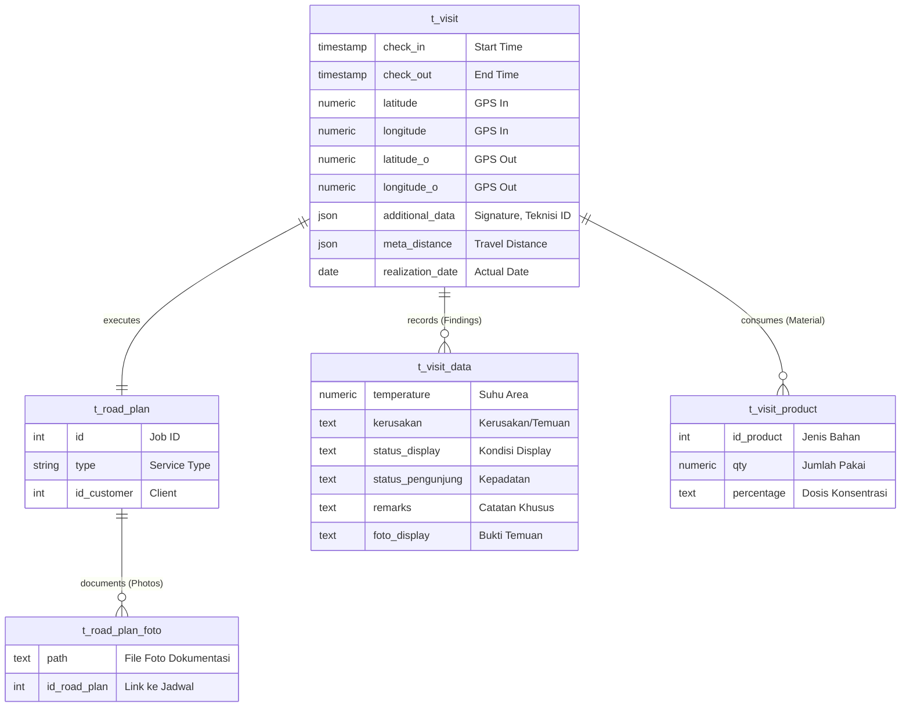

# Daily Data Points Diagram

Visualisasi hubungan antara data kunjungan harian dan detail yang dikumpulkan.

```mermaid
erDiagram
    %% Core Visit Entity
    t_visit ||--|| t_road_plan : "executes"
    t_visit ||--o{ t_visit_data : "records (Findings)"
    t_visit ||--o{ t_visit_product : "consumes (Material)"
    t_road_plan ||--o{ t_road_plan_foto : "documents (Photos)"

    t_visit {
        timestamp check_in "Start Time"
        timestamp check_out "End Time"
        numeric latitude "GPS In"
        numeric longitude "GPS In"
        numeric latitude_o "GPS Out"
        numeric longitude_o "GPS Out"
        json additional_data "Signature, Teknisi ID"
        json meta_distance "Travel Distance"
        date realization_date "Actual Date"
    }

    t_visit_data {
        numeric temperature "Suhu Area"
        text kerusakan "Kerusakan/Temuan"
        text status_display "Kondisi Display"
        text status_pengunjung "Kepadatan"
        text remarks "Catatan Khusus"
        text foto_display "Bukti Temuan"
    }

    t_visit_product {
        int id_product "Jenis Bahan"
        numeric qty "Jumlah Pakai"
        text percentage "Dosis Konsentrasi"
    }

    t_road_plan_foto {
        text path "File Foto Dokumentasi"
        int id_road_plan "Link ke Jadwal"
    }
    
    t_road_plan {
        int id "Job ID"
        string type "Service Type"
        int id_customer "Client"
    }
```
