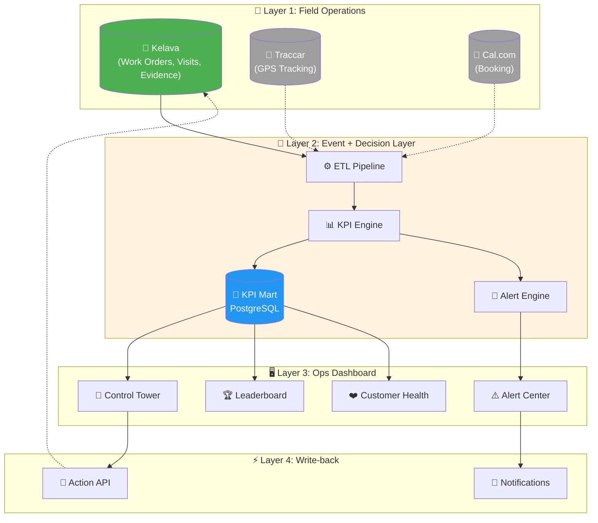
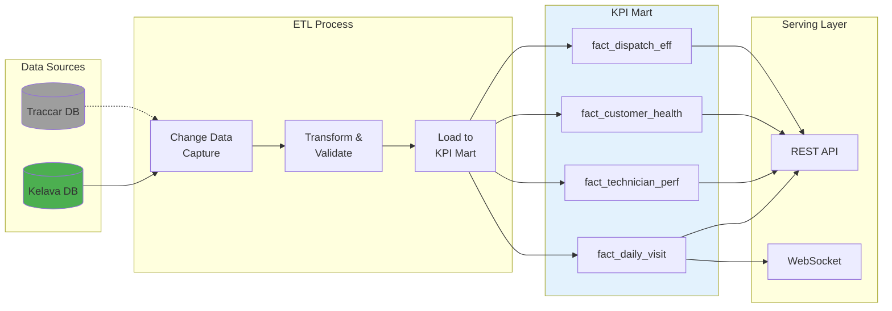
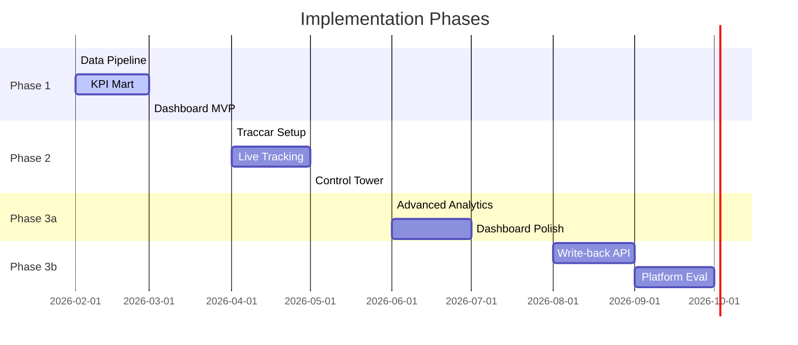
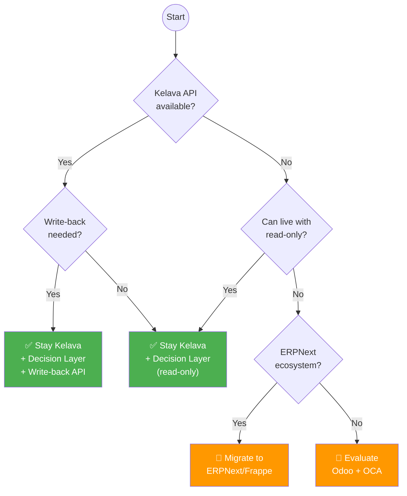
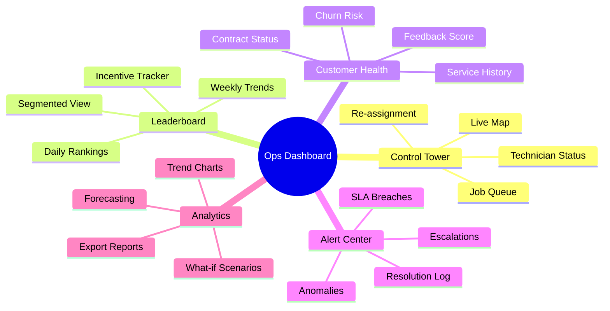
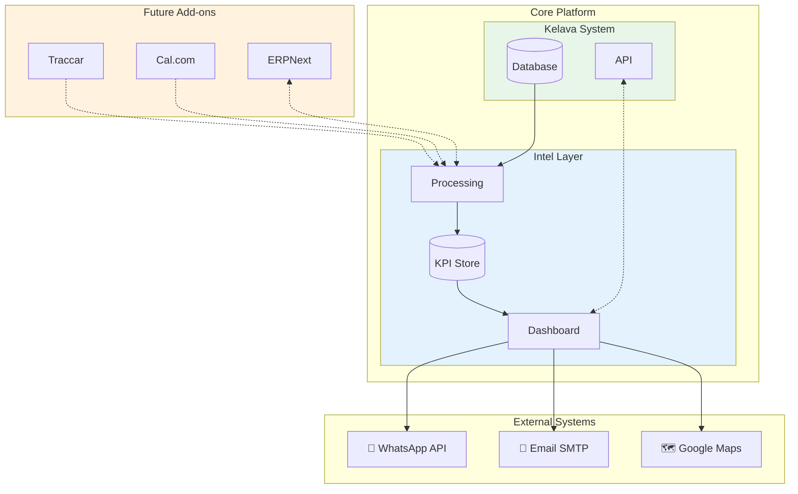
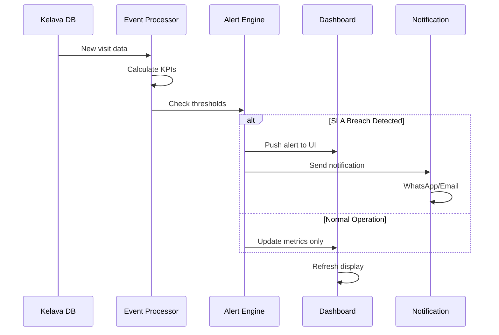

# 📊 Architecture Diagrams

Kumpulan diagram visual untuk arsitektur Safe & Care Operational Intelligence.

---

## 1. High-Level Architecture

---

## 2. Data Flow Detail

---

## 3. Component Placement per Phase

---

## 4. Decision Tree: Platform Choice

---

## 5. Dashboard Module Map

---

## 6. Integration Architecture

---

## 7. Alerting Flow

---

## Usage Notes

### Rendering Diagrams

Diagram-diagram di atas menggunakan **Mermaid** syntax. Untuk melihatnya:

1. **GitHub/GitLab** — Otomatis di-render
2. **VS Code** — Install extension "Markdown Preview Mermaid Support"
3. **Online** — Paste ke [mermaid.live](https://mermaid.live)

### Export Options

Untuk export ke PNG/SVG:
1. Buka [mermaid.live](https://mermaid.live)
2. Paste kode diagram
3. Klik Download PNG/SVG

---

*Last Updated: 2026-02-05*
